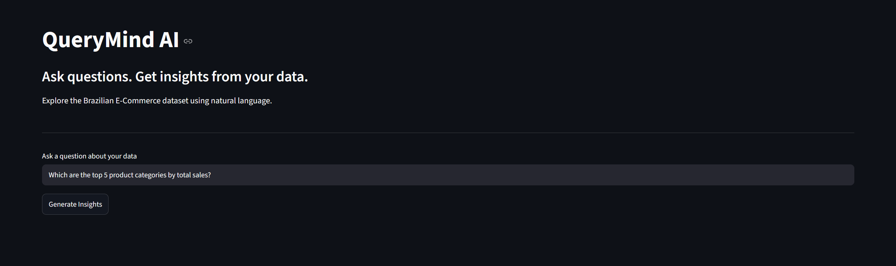
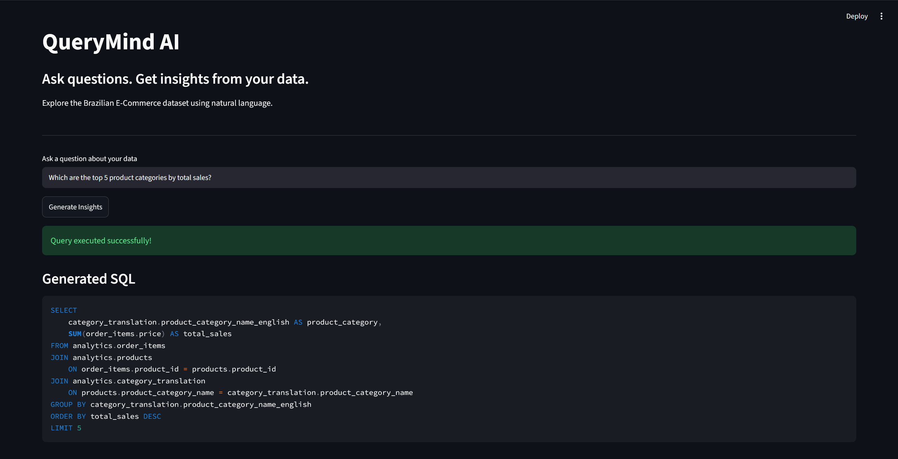
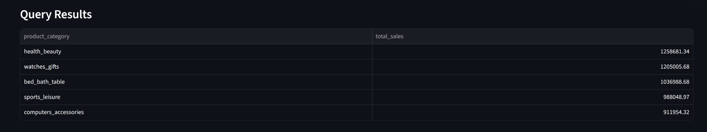
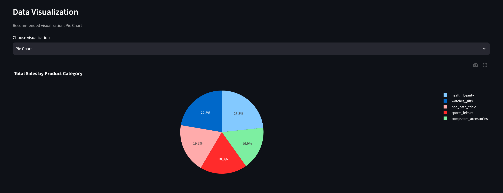

# QueryMind AI
****An AI-powered conversational analytics platform for e-commerce data.****

QueryMind AI enables users to explore structured e-commerce data using natural language. Instead of manually writing SQL queries, users can ask questions in plain English and receive generated SQL, database results, interactive visualizations, and AI-generated insights grounded in the returned data.

The project combines a locally hosted large language model, SQL validation, PostgreSQL, and an interactive Streamlit dashboard to make data analysis more accessible.

---

## Application Screenshots

The following screenshots show the local QueryMind AI workflow, from entering a natural-language question to reviewing SQL, results, visualizations, and AI-generated insights.

### Dashboard


### AI-Generated SQL


### Query Results


### Data Visualization


### AI-Generated Insights


### ## Demo Video

Watch the complete walkthrough of QueryMind AI, demonstrating natural-language queries, AI-generated SQL, database results, interactive visualizations, and automated insights.

[**▶ Watch QueryMind AI Demo**](assets/demo/QueryMind_AI_Demo_Final.mp4)

[Download the demo video](assets/demo/QueryMind_AI_Demo_Final.mp4)

---

## Problem Statement
Traditional data analysis often requires knowledge of SQL, database structures, and visualization tools. This creates a barrier for users who need insights but lack technical expertise.

QueryMind AI addresses this challenge by connecting natural language questions with database queries and meaningful analytical outputs.

## Solution
QueryMind AI provides a workflow that:

1. Accepts natural language questions from users.

2. Uses a large language model to interpret analytical intent.

3. Generates SQL queries based on the database schema.

4. Validates generated SQL before execution.

5. Executes approved queries against PostgreSQL.

6. Presents results through tables and interactive charts.

7. Generates explanations grounded in the returned data.

---

## Features
- ****Natural Language to SQL:**** Convert plain-English questions into SQL queries.

- ****AI-Powered Analytics:**** Use a locally hosted LLM to generate analytical queries.

- ****SQL Validation:**** Restrict query execution to approved read-only operations.

- ****Safe Query Execution:**** Apply result-size limits and statement timeouts.

- ****Interactive Dashboard:**** Explore query results through Streamlit.

- ****Data Visualization:**** Display results using interactive Plotly charts.

- ****AI-Generated Insights:**** Generate concise explanations using actual query results and calculated numeric summaries.

- ****SQL Inspection:**** View the SQL generated by the AI.

- ****Structured Database:**** Query a PostgreSQL analytics schema built from the Olist dataset.

- ****Modular Architecture:**** Separate frontend, database access, query processing, and AI services.

---

## Technology Stack
| Component | Technology |

|---|---|

| Frontend | Streamlit |

| Programming Language | Python |

| Database | PostgreSQL |

| AI Model Runtime | Ollama |

| Language Model | Qwen 2.5 3B |

| SQL Validation | SQLGlot |

| Database Connectivity | psycopg |

| Data Processing | Pandas |

| Visualization | Plotly |

| Environment Configuration | python-dotenv |

| Version Control | Git and GitHub |

---

## Dataset
### Brazilian E-Commerce Public Dataset by Olist
****Source:**** [Kaggle – Olist Brazilian E-Commerce Dataset](https\://www.kaggle.com/datasets/olistbr/brazilian-ecommerce)

The dataset contains information about orders, customers, products, sellers, payments, reviews, deliveries, and geographic locations.

It provides a realistic foundation for exploring business questions such as:

- Which product categories generate the highest sales?

- Which states have the most customers?

- How do order volumes change over time?

- What is the average review score for delivered orders?

- Which sellers contribute most to sales?

The original data is preserved in raw tables, while structured analytics tables are used for querying.

****Note:**** The dataset is not included in this repository. Users must obtain it from Kaggle and follow the setup instructions below.

---

## System Architecture
QueryMind AI follows a modular monolith architecture. The frontend, query pipeline, AI services, and database access layer are separated into distinct modules while remaining within a single application.

```text

                    User

                     |

                     v

             Streamlit Dashboard

                     |

                     v

              Query Pipeline

                     |

          +----------+----------+

          |                     |

          v                     v

    Schema Context         AI Service

          |                     |

          |                     v

          |                  Ollama

          |               (Qwen 2.5 3B)

          |                     |

          |<--------------------+

          |

          v

     SQL Validator

          |

          v

    Query Service

          |

          v

      PostgreSQL

          |

          v

     Query Results

          |

          v

    Insight Service

          |

          v

   Interactive Dashboard

```

### Main Components
- ****Frontend:**** Collects questions and displays SQL, results, charts, and insights.

- ****Schema Context:**** Supplies database structure and analytical guidance to the AI.

- ****AI Service:**** Generates SQL using the local language model.

- ****SQL Validator:**** Checks generated queries against safety rules.

- ****Query Service:**** Executes approved SQL with result limits and timeouts.

- ****Insight Service:**** Produces data-grounded explanations from query results and calculated facts.

- ****PostgreSQL:**** Stores the raw dataset and structured analytics tables.

---

## Project Structure
```text

QueryMind-AI/

│

├── frontend/

│   └── app.py

│

├── backend/

│   ├── api/

│   ├── services/

│   ├── database/

│   └── models/

│

├── data/

│   ├── raw/

│   ├── processed/

│   ├── inspect_dataset.py

│   ├── validate_dataset.py

│   ├── load_data.py

│   ├── profile_data.py

│   ├── test_query_service.py

│   ├── test_sql_validator.py

│   ├── test_query_pipeline.py

│   └── ...

│

├── sql/

├── config/

├── tests/

├── evaluation/

├── docs/

│   └── database_schema.md

│

├── .env.example

├── .gitignore

└── README.md

```

---

## Getting Started
### Prerequisites
Install the following before running the project:

- Python 3.12

- PostgreSQL

- Ollama

- Git

### 1. Clone the Repository
```bash

git clone https\://github.com/ansari-shahid-1/QueryMind-AI.git

cd QueryMind-AI

```

### 2. Create a Virtual Environment
```bash

python -m venv .venv

```

Activate it on Windows PowerShell:

```powershell

.venv\Scripts\Activate.ps1

```

### 3. Install Dependencies
```bash

pip install streamlit pandas plotly "psycopg[binary]" python-dotenv sqlglot ollama

```

### 4. Configure Environment Variables
Create a `.env` file in the project root using `.env.example` as a reference.

Configure the PostgreSQL connection settings required by the application.

****Do not commit `.env` or expose database credentials.****

### 5. Set Up the Database
1. Create a PostgreSQL database named `querymind_ai`.

2. Download the Olist dataset from Kaggle.

3. Place the CSV files in the expected `data/raw/` directory.

4. Follow the data loading and schema preparation scripts in the `data/` and `sql/` directories.

5. Verify the analytics tables and database connection before launching the application.

Refer to [Database Schema Documentation](docs/database_schema.md) for table definitions, relationships, and data considerations.

### 6. Set Up Ollama
Start Ollama and download the model:

```bash

ollama pull qwen2.5:3b

```

Ensure the Ollama service is running before generating AI queries or insights.

### 7. Run the Application
From the project root:

```bash

streamlit run frontend/app.py --server.port 8503

```

Open the application in your browser:

```text

http\://localhost:8503

```

---

## Query Safety
QueryMind AI includes several safeguards to reduce the risk of unsafe or resource-intensive SQL execution.

- Only approved `SELECT` queries are allowed.

- Multiple SQL statements are rejected.

- Access to unapproved database schemas is blocked.

- Query results are limited to 1,000 rows.

- A statement timeout is applied to database queries.

- A dedicated read-only database role is used for analytics access.

These controls provide defense in depth for the current application. They are not a substitute for a comprehensive production security review.

---

## Testing and Validation
The project includes scripts for validating important parts of the system.

Examples:

```bash

python -m data.test_query_service_security

python -m data.test_query_limits

python -m data.test_query_pipeline

python -m data.test_insight_validator

```

The validation workflow covers:

- Rejection of mutation queries such as `DELETE` and `UPDATE`.

- Rejection of multiple SQL statements.

- Restriction of access to approved analytics tables.

- Enforcement of query result limits.

- Cancellation of long-running queries.

- Natural-language-to-SQL generation and execution.

- Calculation of numeric summaries used by the insight service.

---

## Current Development Status
| Component | Status |

|---|---|

| Python environment and project setup | Complete |

| Dataset inspection and validation | Complete |

| PostgreSQL database setup | Complete |

| Raw and analytics table preparation | Complete |

| Database relationships and schema documentation | Complete |

| Read-only database access | Complete |

| Natural-language-to-SQL pipeline | Implemented and tested |

| SQL validation and query limits | Implemented and tested |

| Streamlit dashboard | Implemented |

| Interactive visualizations | Implemented |

| AI-generated insights | Implemented |

| Core end-to-end workflow | Verified |

| Final documentation and repository preparation | In progress |

| Deployment | Not applicable — runs locally |

---

## Future Improvements
- Improve SQL generation accuracy across a broader range of analytical questions.

- Build a benchmark of questions with verified SQL and expected results.

- Expand automated evaluation of generated queries and insights.

- Add conversational query history.

- Improve chart recommendations for different analytical scenarios.


- Extend documentation with evaluation results.

---

## Author
****Shahid Ansari****

B.Tech in Computer Science and Engineering

VIT Bhopal

****Project:**** QueryMind AI

Developed as a project focused on AI-powered conversational analytics, natural language to SQL, database systems, and interactive data visualization.

[GitHub Profile](https\://github.com/ansari-shahid-1)

---

## License
A license has not yet been specified for this repository.
